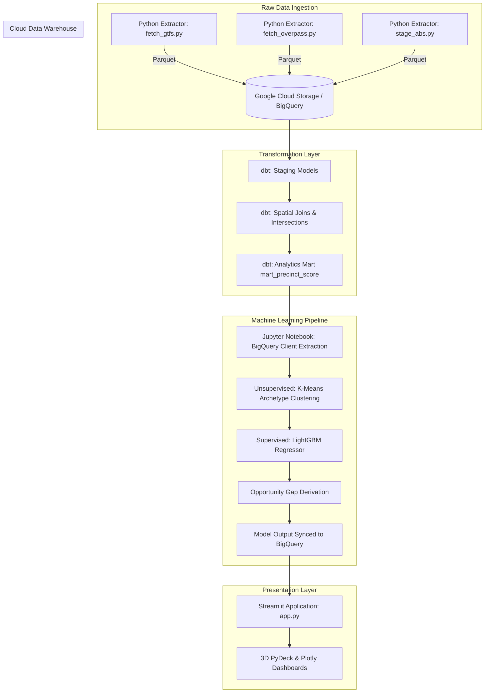

# Transit Catchment Opportunity Engine

## 1. Problem Statement

Modern urban planners, policy makers, and property developers face immense operational challenges when attempting to align public transit infrastructure with underlying demographic demand and spatial characteristics. As metropolitan areas like Greater Melbourne experience rapid, asymmetrical urban sprawl, traditional heuristic-based transit planning often fails to identify micro-level infrastructural deficits. The primary bottleneck lies in the fragmentation of crucial urban datasets; transit schedules (General Transit Feed Specification - GTFS), active transport and commercial infrastructure mappings (OpenStreetMap - OSM), and granular demographic statistics (Australian Bureau of Statistics - ABS) reside in disparate, fundamentally incompatible spatial formats. 

To overcome these structural data limitations, this project engineers a highly performant, unified spatial data ecosystem utilizing the Uber H3 Hexagonal Hierarchical Spatial Index. By standardizing the Greater Melbourne area into a continuous grid of Resolution-8 hexagons (approximately 0.7 square kilometers each), the system facilitates the deterministic intersection of multi-modal transit networks against hyper-local population densities and commercial activity nodes. This grid establishes the foundational geometry required for advanced spatial analytics, entirely eliminating the boundary irregularities associated with traditional cadastral or postal delimitations.

The core analytical mechanism of the Transit Catchment Opportunity Engine is the "Opportunity Gap." This metric represents a mathematical quantification of transit service deficit. It is derived via a robust Machine Learning pipeline that calculates the theoretical baseline of public transit demand—predicted strictly through physical infrastructure attributes and population constraints—and subsequently subtracts the actual observed transit supply. By isolating regions with high predicted demand but low empirical supply, the engine programmatically surfaces the most critically under-served precincts. 

This approach shifts the paradigm from reactive infrastructure planning to proactive, predictive allocation. Instead of merely responding to overcrowding reports, city planners can utilize this empirical data to strategically deploy targeted bus routes, micromobility hubs, or heavy rail extensions precisely where the underlying structural demand dictates. Consequently, this engine provides data-driven targeting for capital infrastructure allocation, environmental impact reduction, and highly optimized real estate investment strategies.

## 2. Table of Contents
- [1. Problem Statement](#1-problem-statement)
- [3. Architecture and Data Flow](#3-architecture-and-data-flow)
- [4. Folder Structure](#4-folder-structure)
- [5. Step-by-Step Development Process](#5-step-by-step-development-process)
- [6. Future Improvements](#6-future-improvements)
- [7. Streamlit Dashboard Architecture](#7-streamlit-dashboard-architecture)
- [8. Links to Datasets](#8-links-to-datasets)

## 3. Architecture and Data Flow

The system architecture is designed for enterprise-grade scalability, leveraging a modern cloud data stack and event-driven data ingestion paradigms to process high-volume spatial data pipelines efficiently.



## 4. Folder Structure

The repository maintains a strict modular architecture to separate the extraction pipelines, transformation logic, predictive modeling, and user interface components.

* `/extract`: Houses Python ingestion scripts (`fetch_gtfs.py`, `fetch_overpass.py`, `stage_abs.py`, etc.) responsible for interfacing with external APIs, managing schema enforcement, and exporting raw datasets into compressed Parquet format.
* `/dbt_vic`: Contains the core data build tool (dbt) project. This encompasses the configuration (`dbt_project.yml`), source definitions, staging models, and the final highly-optimized analytical marts utilizing native BigQuery spatial functions.
* `/notebooks`: Contains `precinct_clustering.ipynb`, the interactive analytical environment used to prototype, train, evaluate, and operationalize the K-Means clustering and LightGBM predictive models.
* `/streamlit`: Hosts the `app.py` script, serving as the frontend command center. It utilizes Streamlit for routing and state management alongside PyDeck and Plotly for high-fidelity geospatial rendering.
* `/secrets`: A secure, git-ignored directory storing the Google Cloud Platform (GCP) service account JSON credentials required for BigQuery authentication.
* `/data`: A localized directory structure for buffering raw and staged Parquet files prior to cloud warehouse loading.
* `/logs`: Maintains execution logs generated by the Python extractors for auditing and debugging.

## 5. Step-by-Step Development Process

### Step 1: Raw Data Extraction and Parquet Serialization
Data acquisition was standardized through custom Python extractors targeting the PTV GTFS API, the Overpass API for OSM, and ABS demographic endpoints. To ensure high-throughput processing and rigorous type safety prior to cloud ingestion, all extracted DataFrames were serialized into the columnar Parquet format. Stringent dtype mappings were explicitly defined during extraction to mitigate downstream BigQuery schema inference anomalies.

```python
# Snippet from extract/fetch_gtfs.py highlighting explicit schema enforcement
import pandas as pd
from pathlib import Path

# Enforce stringent string typing to prevent BigQuery schema inference errors
df_stops = pd.read_csv(
    stops_file, 
    dtype={
        'stop_id': str, 
        'stop_code': str, 
        'zone_id': str, 
        'parent_station': str
    },
    low_memory=False
)
df_stops['network_type'] = network_name
stops_output = Path("data/staged/stg_gtfs_stops.parquet")
df_stops.to_parquet(stops_output, index=False)
```

### Step 2: Spatial Data Warehousing and Transformation (dbt + BigQuery)
Following ingestion into Google Cloud BigQuery, dbt was deployed to orchestrate the spatial transformation layer. The pipeline converts standard coordinate points into `ST_GEOGPOINT` objects and subsequently projects them into the H3 Resolution-8 grid. The most critical operation occurs within `mart_precinct_score.sql`, where an intensive spatial join (`ST_INTERSECTS`) is executed to aggregate localized transit stops and infrastructural features into their corresponding hexagonal boundaries.

```sql
-- Snippet from dbt_vic/models/marts/mart_precinct_score.sql mapping stops to hexagons
-- Spatial Join: Intersecting localized stops into regional hex grids
hex_stop_intersections as (
    select 
        h.hex_id,
        u.stop_id,
        u.walkable_population,
        u.daily_trips
    from hex_features as h
    inner join unified_stops as u 
        on st_intersects(h.hex_geometry, u.stop_geometry)
),

-- Aggregation: Roll up transit metrics to the hex level
hex_stop_aggregates as (
    select 
        hex_id,
        count(distinct stop_id) as transit_stop_count,
        cast(avg(walkable_population) as int64) as precinct_population,
        sum(daily_trips) as precinct_daily_trips
    from hex_stop_intersections
    group by hex_id
)
```

### Step 3: Unsupervised Machine Learning (K-Means Archetyping)
To programmatically categorize disparate urban environments, the analytical mart was extracted into a Jupyter environment. A `StandardScaler` was applied to normalize the variance across high-dimensionality infrastructure metrics (walkways, cycleways, retail footprints, and point-of-interest density). A K-Means clustering algorithm (optimized at k=5) was executed to autonomously segment the Greater Melbourne area into distinct Urban Archetypes, providing necessary categorical features for downstream supervised models.

```python
# Snippet demonstrating the standardization and clustering pipeline
from sklearn.preprocessing import StandardScaler
from sklearn.cluster import KMeans

# Feature normalization for algorithmic stability across scale-variant features
scaler = StandardScaler()
X_scaled = scaler.fit_transform(df[['walkway_count', 'cycleway_count', 'retail_count', 'total_poi_count']])

# Archetype classification via K-Means clustering
kmeans = KMeans(n_clusters=5, random_state=42)
df['archetype'] = kmeans.fit_predict(X_scaled)
```

### Step 4: Supervised Machine Learning (LightGBM) & Opportunity Gap Derivation
A LightGBM Regressor was engineered to predict the theoretical `precinct_daily_trips`—the dependent variable—based entirely on independent infrastructural and demographic attributes. Following rigorous hyperparameter tuning and evaluation via Root Mean Square Error (RMSE), the model output was utilized to derive the cardinal metric: the `opportunity_gap`. This gap represents the delta between the model's predicted infrastructure demand and the empirically recorded transit supply, accurately identifying zones experiencing critical service deficits.

```python
# Snippet demonstrating demand prediction and gap calculation
import lightgbm as lgb

# Initialize and fit the LightGBM regression model to predict transit demand
regressor = lgb.LGBMRegressor(n_estimators=150, learning_rate=0.05, random_state=42)
regressor.fit(X_train, y_train)

# Derive the opportunity gap mapping mapping structural transit deficits
df['predicted_daily_trips'] = regressor.predict(X_total)
df['opportunity_gap'] = df['predicted_daily_trips'] - df['precinct_daily_trips']
```

### Step 5: High-Performance Spatial Dashboarding (Streamlit + PyDeck/Plotly)
The presentation layer was implemented using Streamlit, establishing an enterprise-grade visualization interface. Given the high density of spatial geometries, the application utilizes dynamic rendering via `plotly.express.choropleth_mapbox` for 2D overviews, and `pydeck` for hardware-accelerated 3D extrusion modeling of the Opportunity Gap. The interface is highly reactive, supporting complex multidimensional filtering and reverse geocoding heuristics to translate mathematical hex boundaries into actionable human-readable nomenclature.

```python
# Snippet highlighting the PyDeck 3D map implementation utilizing the Opportunity Gap
import pydeck as pdk
import json

layer = pdk.Layer(
    "GeoJsonLayer",
    json.loads(filtered_pdk.to_json()),
    pickable=True,
    stroked=True,
    filled=True,
    extruded=True,
    wireframe=True,
    get_fill_color="properties.fill_color",
    # Extrude polygons dynamically based on the calculated Opportunity Gap
    get_elevation="properties.elevation",
    get_line_color=[255, 255, 255, 50],
    line_width_min_pixels=1,
)
```

## 6. Future Improvements

* Deprecate the dependency on real-time reverse geocoding via `geopy` by refactoring the pipeline to execute a native spatial intersection within dbt, leveraging official ABS Suburb boundary shapefiles.
* Ingest and integrate live real-estate pricing telemetry via commercial APIs to investigate and quantify the statistical correlations between localized transit infrastructure deficits and long-term property valuation trajectories.
* Architect a comprehensive Continuous Integration and Continuous Deployment (CI/CD) framework utilizing GitHub Actions to enforce automated execution of dbt schema tests, code linting, and cloud environment deployments.
* Deploy an Airflow orchestration layer to automatically rebuild the analytical marts on a scheduled cadence when GTFS timetable variations are published.

## 7. Streamlit Dashboard Architecture

The frontend of the Transit Catchment Opportunity Engine is powered by a robust Streamlit application designed to translate high-dimensionality spatial models into an intuitive, decision-support interface. The architecture focuses on performance and user experience through the following core components:

* **State Management & Caching**: The application leverages Streamlit's `@st.cache_data` decorators to instantiate the BigQuery Client and load the multi-megabyte `mart_precinct_score` payload precisely once per session. This mitigates redundant network latency and significantly reduces cloud compute expenditures.
* **Geospatial Projections**: The core visualization engine implements a dual-mode map interface. The primary 2D projection utilizes `plotly.express.choropleth_mapbox` configured with a dark-matter cartographic style to highlight granular archetypal boundaries. The secondary 3D projection employs PyDeck (`pdk.Deck`) to extrude the H3 hexagonal polygons vertically on the z-axis strictly proportional to the calculated Opportunity Gap, immediately drawing the user's attention to high-deficit zones.
* **Reactive Filtering Pipeline**: A dynamic sidebar controls global application state, allowing users to apply multidimensional filters across minimum populations, POI densities, and explicit Urban Archetypes. These filters reactively mutate the underlying Pandas DataFrame in memory, which immediately propagates state changes down to all spatial renderings and the underlying 2x2 analytical grid.
* **Asynchronous Reverse Geocoding**: To bridge the gap between mathematical hex identifiers and real-world urban planning, the dashboard implements a `geopy.geocoders.Nominatim` client. This client dynamically resolves coordinate centroids into human-readable suburban nomenclature, enriching the Top 10 Opportunity table for non-technical stakeholders.

## 8. Links to Datasets

* **Public Transport Victoria (PTV) GTFS Data**: https://discover.data.vic.gov.au/dataset/ptv-timetable-api
* **OpenStreetMap (OSM) Victoria Extract**: https://download.geofabrik.de/australia-oceania/australia.html
* **Australian Bureau of Statistics (ABS) Population & Suburb Geographies**: https://www.abs.gov.au/
