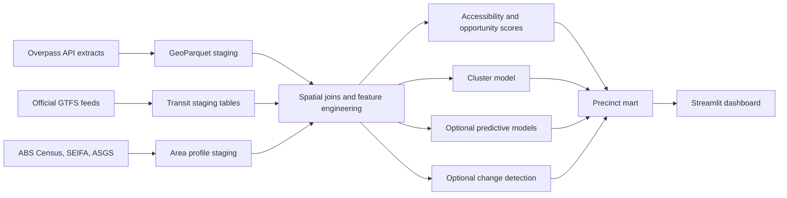
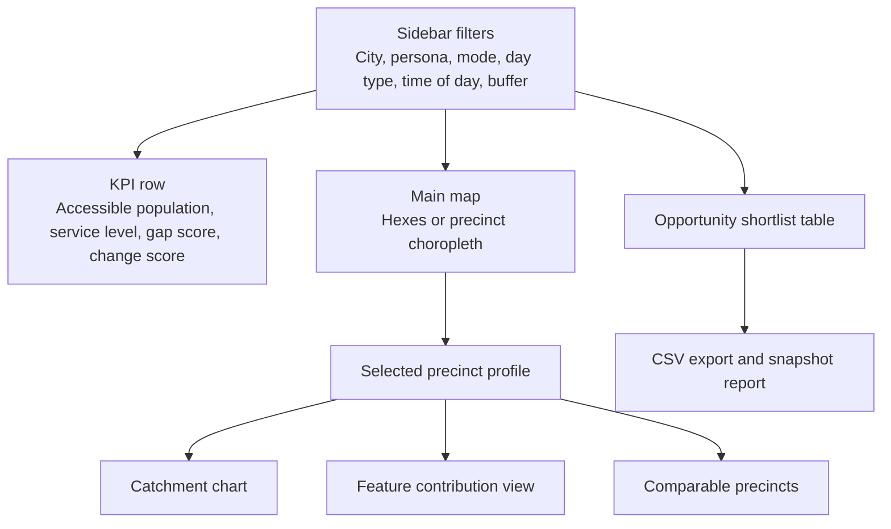

# Transit Catchment Opportunity Engine for Australian Precinct Intelligence

## Executive summary

The strongest project for an Analytics Engineer portfolio is a **Transit Catchment Opportunity Engine**: use Overpass Turbo to prototype tag-level extractions from OpenStreetMap, combine those with official GTFS feeds for Melbourne, Sydney, and Brisbane, then enrich the result with Census, SEIFA, and ASGS geography from the Australian Bureau of Statistics. The finished Streamlit dashboard ranks precincts and stop catchments by **accessible demand, first/last-mile quality, land-use support, and business opportunity**. That creates direct value for property developers, retail expansion teams, transport agencies, and city planners, while still being intuitive enough for a commuter-facing comparison layer.

What makes this better than a generic "map dashboard" is the combination of **data engineering, spatial modelling, time-aware transit analysis, and decision-support design**. GTFS gives you core timetable files such as stops, routes, trips, stop times, and calendars; ABS Community Profiles and DataPacks provide demographic, dwelling, motor-vehicle, and journey-to-work context; and SEIFA adds socio-economic ranking. That means you can build both a robust analytical product and one genuinely predictive workstream, such as estimating public-transport propensity or parking-light development potential at SA1 or SA2 level.

The recommended MVP uses exactly **two complementary online sources beyond Overpass**: **official GTFS** and **ABS Census/SEIFA**. If you want a stronger operations or property-investment angle, add a city-specific stretch module using an official traffic or property feed from a state portal. The safest recruiter story is therefore: **cross-city, business-facing precinct intelligence first; forecasting or price-uplift as a focused extension second**.

| Variant | Focus | Data sources | Novelty | Stakeholder value | Difficulty | Estimated time |
|---|---|---|---|---|---|---|
| **Transit Catchment Opportunity Engine** *(Recommended)* | Rank precincts for site selection, stop upgrades, and transit-oriented development | Overpass + official GTFS + ABS Census/SEIFA | High | Broadest: developers, planners, agencies, commuters | Medium-high | 6–8 weeks |
| **Corridor Reliability and Mode-Shift Monitor** | Detect congestion/reliability issues and identify where active-mode investment could reduce pressure | Overpass + GTFS-RT or traffic counts | Very high | Strongest for transport operators, employers, logistics | High | 8–10 weeks |
| **Property Premium Near Transit Uplift Explorer** | Quantify how transport access and micro-amenities relate to sales growth or price premium | Overpass + official GTFS + state property sales | High | Strongest for developers, lenders, asset managers | Medium | 5–7 weeks |

The data availability behind those variants is real rather than hypothetical. Official online examples include Victoria GTFS Schedule, TfNSW Timetables Complete GTFS, TransLink GTFS, ABS Census DataPacks, ABS SEIFA 2021, Victoria Traffic Signal Volume Data, NSW Traffic Volume Counts API, Brisbane intersection volume feed, Victorian Property Sales Report, and NSW land value and property sales map.

## Recommended project and stakeholder value

The best framing is this: **Which precincts combine high accessible population and worker demand with transit service strength and good last-mile infrastructure, and which high-potential precincts are still under-served?** That question is commercially useful because a developer or retailer can use it to shortlist sites, a transport agency can use it to prioritise stop and frequency upgrades, and a planner can use it to justify footpath, cycleway, or parking interventions. For a recruiter, it reads like a real location-intelligence product rather than a classroom exercise.

In Melbourne the dashboard can compare tram–rail–bus interchange precincts with middle-ring car-dependent precincts; in Sydney it can contrast rail or Metro-led precincts with bus-dependent growth corridors; in Brisbane it can compare busway catchments against suburban rail catchments. Because the demographic backbone comes from ABS geographies and the service backbone comes from GTFS, the same metric design can be reused across all three cities instead of being built once and trapped in a single local portal.

| City example | Official online sources | Strongest business angle |
|---|---|---|
| Melbourne | Victoria GTFS Schedule, optional Victoria GTFS Realtime, optional Victorian Property Sales Report | Build-to-rent, mixed-use development, tram-access retail, parking-light projects |
| Sydney | TfNSW Timetables Complete GTFS, optional TfNSW historical GTFS and GTFS Realtime, optional NSW Traffic Volume Counts API or NSW land value and property sales map | Corridor operations, developer due diligence, station-precinct retail |
| Brisbane | TransLink GTFS, optional TransLink real-time data, optional Brisbane intersection volume feed | Busway catchment strategy, suburban centre comparison, commuter accessibility |

The KPI layer should be persona-based, so the same data model supports multiple decision-makers rather than forcing one generic score that means too many things at once.

| Stakeholder | KPI in the dashboard | Actionable output |
|---|---|---|
| Property developers | Accessible population in 15 and 30 minutes, parking-light feasibility, amenity gap, no-car household share | Rank candidate sites, refine parking ratios, identify mixed-use opportunities |
| Transport agencies | Frequent-service coverage, service per 1,000 residents or workers, under-served catchments, reliability alerts | Prioritise frequency increases, stop upgrades, interchange investment |
| City planners | Footpath and cycleway deficit near high-demand stops, land-use mix, infrastructure change score | Target streetscape works, crossing upgrades, active-transport capital works |
| Retailers and location teams | Catchment spend proxy, worker density, transit footfall proxy, competitive amenity density | Shortlist store locations, assess format mix, compare precincts |
| Commuters | Door-to-stop walk quality, transfer burden, journey-time access to jobs and services | Compare precinct liveability and commute convenience |

## Data sources and extraction design

Use **Overpass for the micro built environment**, **GTFS for service supply**, and **ABS for demand and socio-economic context**. Overpass Turbo is the prototyping and export surface; the actual production ETL should call an Overpass API endpoint in batch. The Overpass documentation distinguishes Turbo from the API itself, and the public-instance guidance makes clear that shared infrastructure is fine for modest use but not a sensible backend for repeated app-triggered full-city queries. That pushes you towards precomputed tiles, cached extracts, and stored snapshots, which is exactly the sort of production-minded design that recruiters want to hear from an Analytics Engineer.

The core online source stack should look like this.

| Layer | Official online source | What to extract | Why it matters |
|---|---|---|---|
| OSM/Overpass | Overpass Turbo docs and public Overpass API instances | Geometry, tags, snapshot date, nodes/ways/relations | Finest-grain view of walkability, cycle access, parking, land use, and POIs |
| Transit | GTFS specification plus city feeds such as Victoria GTFS Schedule, TfNSW GTFS, TransLink GTFS | Stops, routes, trips, stop_times, calendars, route_type | Formal supply side: headways, service span, stop access, transfer structure |
| Demographics and geography | ABS Census DataPacks, ABS Community Profiles, ABS SEIFA 2021, ABS ASGS digital boundaries | Population, households, motor vehicles, journey to work, SEIFA, SA1/SA2 boundaries | Demand context and target variables for scoring or supervised models |

For the Overpass layer, the feature schema should be explicit and business-led rather than "download whatever OSM has". The OSM public transport and map-feature documentation supports using `public_transport` stop positions and platforms, transport stop features, walking and cycling ways, parking amenities, and land-use categories as stable analytical building blocks.

| Feature group | Exact OSM tags or filters | Use in the project |
|---|---|---|
| Public transport stops and interchanges | `public_transport=platform`, `public_transport=stop_position`, `highway=bus_stop`, `railway=station|tram_stop|halt`, `amenity=ferry_terminal` | Stop inventory, interchange density, multimodal access |
| Walking network | `highway=footway|path|pedestrian|steps`, roads with `sidewalk=*` | Walkability, crossing friction, 400m and 800m access quality |
| Cycling network | `highway=cycleway`, roads with `cycleway=*`, `amenity=bicycle_parking` | Bike-and-ride readiness, active-mode support |
| Parking | `amenity=parking`, `amenity=parking_entrance`, `amenity=parking_space` | Car dependence, park-and-ride proxy, development parking context |
| Land use and activity | `landuse=residential|commercial|retail|industrial|construction`, `shop=*`, selected `amenity=*` such as school, university, hospital, clinic | Land-use mix, destination density, precinct activation |

A reusable precinct-scale Overpass query can therefore be set up like this. It is deliberately written against `{{bbox}}` so that you can tile large urban areas and avoid hammering a shared public instance.

```overpass
[out:json][timeout:120];

(
  nwr["public_transport"~"platform|stop_position"]({{bbox}});
  nwr["highway"="bus_stop"]({{bbox}});
  nwr["railway"~"station|tram_stop|halt"]({{bbox}});
  nwr["amenity"="ferry_terminal"]({{bbox}});

  way["highway"~"footway|path|pedestrian|steps"]({{bbox}});
  way["highway"]["sidewalk"]({{bbox}});

  way["highway"="cycleway"]({{bbox}});
  way["highway"]["cycleway"]({{bbox}});
  nwr["amenity"="bicycle_parking"]({{bbox}});

  nwr["amenity"~"parking|parking_entrance|parking_space"]({{bbox}});
  nwr["landuse"~"residential|commercial|retail|industrial|construction"]({{bbox}});
  nwr["amenity"~"school|hospital|university|clinic"]({{bbox}});
  nwr["shop"]({{bbox}});
);

out center tags;
```

That query is enough for the MVP. For change detection, keep the same logic and rerun it with Overpass QL's `date` setting to reconstruct earlier snapshots. The Overpass QL reference explicitly documents `date:"YYYY-MM-DDThh:mm:ssZ"` for attic queries, and notes that attic data does not go back earlier than September 2012. That makes monthly or quarterly "infrastructure momentum" scoring feasible without introducing a new source.

## Data model and preprocessing

The right analytical grain is **multi-level rather than single-level**: use **hexes** for interactive mapping, **GTFS stop catchments** for service analysis, and **SA1/SA2** for stable reporting and ABS joins. GTFS gives you the timetable keys; ABS gives you the smallest practical statistical geographies and their boundaries; and the ABS digital boundary files are available in GeoPackage or ESRI shapefile, with both GDA2020 and GDA94 versions.



The semantic model should look like a small warehouse rather than a notebook folder full of CSVs.

| Table | Grain | Key fields | Purpose |
|---|---|---|---|
| `stg_osm_feature` | OSM object snapshot | `osm_id`, `osm_type`, `snapshot_date`, `feature_group`, `tags_json`, `geom` | Normalised Overpass output |
| `stg_gtfs_stop` | Stop | `city`, `feed_version`, `stop_id`, `stop_name`, `parent_station`, `geom` | Canonical stop dimension |
| `stg_gtfs_service_hour` | Stop-hour-date pattern | `stop_id`, `route_type`, `day_type`, `hour`, `trip_count`, `avg_headway_min`, `span_start`, `span_end` | Frequency and span mart |
| `stg_abs_area` | SA1 or SA2 | `asgs_code`, `level`, `population`, `households`, `workers`, `income`, `seifa`, `pt_commute_share`, `no_vehicle_share`, `geom` | Demand and socio-economic context |
| `int_hex_feature` | Hex per snapshot | `hex_id`, `city`, `footway_len_m`, `cycleway_len_m`, `parking_count`, `poi_density`, `landuse_entropy`, `intersection_density` | Derived built-environment features |
| `int_stop_catchment` | Stop-buffer-date | `stop_id`, `buffer_m`, `population_in_buffer`, `jobs_proxy`, `walk_infra_score`, `bike_infra_score`, `parking_score` | Stop catchment mart |
| `mart_precinct_score` | Precinct-date | `precinct_id`, `city`, `access_score`, `demand_score`, `gap_score`, `cluster_label`, `priority_flag` | Dashboard-ready layer |

The preprocessing path should be straightforward and reproducible.

1. **Define city boundaries** with ABS ASGS or a chosen metro study area, then reproject all geometries to an analysis CRS suitable for distance and area calculations.
2. **Extract OSM in tiles** using the Overpass query above, storing raw JSON and normalised GeoParquet with one row per feature snapshot.
3. **Parse GTFS** into stops, routes, trips, stop_times, and calendars, then aggregate to stop-hour and corridor-hour service measures. GTFS is explicitly structured as a set of text files inside a ZIP archive for exactly this purpose.
4. **Load ABS Census/SEIFA profiles** at SA1 or SA2. Community Profiles provide a broad statistical picture of an area, the Working Population Profile includes method of travel to work, and the General Community Profile includes motor-vehicle counts.
5. **Engineer geospatial joins** from hexes and stop buffers to SA1 or SA2, using population-weighted allocation where boundaries overlap multiple catchments.
6. **Create accessibility marts** such as peak and off-peak reachable stops, services, and destinations within 15, 30, and 45 minutes.
7. **Freeze a modelling dataset** with one row per precinct or area and one time stamp per feed snapshot, so the app reads stable marts rather than calling source APIs live.

The one honest caveat is that ABS is structurally rich but not high-frequency. That is fine for a **precinct opportunity product**, because the core question is structural location quality rather than minute-by-minute ridership. If you want real demand forecasting, you should treat traffic or GTFS-RT as a stretch module rather than pretending that Census is a daily signal.

## Analytics and ML design

The smartest modelling choice is to have an **analytics-first MVP** and a **single supervised benchmark** that uses no extra paid data. In practical terms, that means: build deterministic accessibility and opportunity scores first, then train a model that predicts **public-transport commute share** or **no-motor-vehicle share** from OSM and GTFS features at SA1 or SA2 level. ABS already publishes the relevant journey-to-work and motor-vehicle variables, so you get a genuine prediction problem without inventing a weak label.

| Task | Inputs | Suggested model type | Evaluation metrics | Why it is valuable |
|---|---|---|---|---|
| Accessibility scoring | Overpass + GTFS + ABS | Weighted scorecard, PCA-calibrated index, or constrained linear scoring | Rank stability, correlation with PT commute share, planner review | Clear business-facing baseline |
| Precinct clustering | Overpass + GTFS + ABS | HDBSCAN or KMeans | Silhouette score, Davies–Bouldin, cluster stability across cities | Produces interpretable precinct archetypes |
| Transit propensity benchmark | Overpass + GTFS as features; ABS PT share or no-vehicle share as target | Elastic Net, LightGBM, CatBoost | MAE, RMSE, R², Spearman rank correlation | Strong ML story without needing paid labels |
| Opportunity gap ranking | Outputs from score and benchmark | Rules-based ranking or gradient-boosted ranker | Top-decile lift, precision at top-k precincts | Converts analytics into an investment shortlist |
| Anomaly detection stretch module | GTFS-RT or traffic counts + Overpass context | STL residuals, Isolation Forest, rolling z-score | Precision@k, false alerts per week | Useful for transport operations |
| Demand or price forecasting stretch module | Traffic/property history + engineered features | SARIMAX, LightGBM with lag features, CatBoost | WAPE, MASE, RMSE, P90 absolute error | Stronger commercial storytelling in Variant B or C |
| Infrastructure change detection | Overpass dated snapshots | Snapshot diff rules, change-point logic | Manual precision on reviewed sample | Shows how precincts are evolving |

The feature engineering is where this project becomes distinctive. The most useful features are:

- **400m and 800m stop catchment statistics** for population, households, workers, and key amenities
- **Scheduled frequency and service span** by stop, mode, hour, weekday, and weekend
- **Travel-time accessibility features** such as jobs, universities, hospitals, or retail clusters reachable within 15 and 30 minutes
- **POI density and diversity** from OSM, not just raw counts
- **Land-use mix entropy** using residential, commercial, retail, industrial, and construction polygons
- **Walk- and cycle-network metrics** such as intersection density, cul-de-sac share, centrality, and network circuity
- **Parking pressure proxies** from parking supply and low-car-household mismatch
- **Infrastructure momentum** from month-on-month OSM change volumes
- **Relative supply-per-demand measures**, for example trips per 1,000 residents or workers

For validation, avoid the usual beginner mistake of random row splits. Spatial leakage is real. A better design is **leave-one-city-out validation**: train on two of Melbourne, Sydney, and Brisbane, then test on the third. You can also add buffered spatial cross-validation within each city. That choice alone will sound much more credible in an interview than a single random 80/20 split.

The most business-relevant final outputs are not model scores for their own sake. They are **ranked precinct lists**, **archetype labels**, **what-if scenario deltas**, and **explainability views**. For example: "These ten precincts have strong reachable demand but weak cycling access"; "These five stops serve disproportionately high worker density but have poor service span"; or "This precinct scores highly enough that a lower-parking residential format is plausible."

## Streamlit dashboard and deployment

The Streamlit app should feel like a real internal decision-support tool rather than a one-page chart collection. A portfolio reviewer should be able to open it, pick a city, choose a stakeholder persona, and immediately see how the ranking changes. Streamlit's own deployment and caching documentation makes it well suited to exactly this type of app, especially when the expensive computation is done upstream and the interface only reads precomputed marts.



The key interactive components should be:

- **Sidebar persona toggle** for developer, transport agency, planner, or commuter weights
- **Map layer switcher** between hex grid, stop buffers, and SA2 roll-up
- **Peak/off-peak and weekday/weekend switch** driven by GTFS aggregates
- **Precinct comparison drawer** for side-by-side analysis of two to four candidate areas
- **Feature contribution panel** showing why a precinct ranks highly or poorly
- **Change-detection view** showing where walk, cycle, parking, or stop infrastructure has changed over time
- **Export buttons** for top-k precinct shortlist, stop-priority list, and PDF-style summary snapshot

For deployment, the design principle should be **batch heavy, app light**. Streamlit Community Cloud is perfectly reasonable for a public portfolio build, and its docs cover deployment, data connections, caching, and secrets management. But the app should read parquet or a spatial database that is refreshed nightly or weekly, not call Overpass or parse GTFS from scratch for every user interaction. Overpass public infrastructure is shared and explicitly not intended to be the backend for heavy query workloads; Streamlit's caching tools help, but the real fix is precomputation.

A sensible refresh cadence is:

- **OSM/Overpass**: weekly for the MVP, monthly snapshots for change detection
- **GTFS static**: weekly or whenever a new feed version appears
- **GTFS-RT or traffic stretch modules**: every 5–15 minutes upstream, aggregated before entering the app
- **ABS**: ad hoc when a new release matters; operationally this is a slow-moving dimension table

Because you are using OSM, visible attribution is not optional. The OSM attribution guidelines state that attribution must be shown to anyone using or viewing the produced work, and the OSM licence notes the ODbL basis. In the app, place source and licence attribution in the footer and metadata panel from day one.

If the dataset grows beyond what a simple portfolio deployment can handle, keep Streamlit as the front end and move the refresh jobs plus storage into a managed container and spatial database stack. With no budget constraint, that is the cleaner production architecture anyway.

## Delivery plan and presentation

A realistic delivery plan is short enough to ship, but structured enough to demonstrate engineering discipline.

| Week | Milestone | Deliverable |
|---|---|---|
| Week 1 | Scope and source contracts | City boundary choice, source inventory, Overpass query library |
| Week 2 | Staging models | GTFS parsers, ABS loaders, raw OSM normalisation |
| Week 3 | Intermediate geospatial marts | Stop-hour service mart, hex features, SA1/SA2 joins |
| Week 4 | Baseline analytics | Accessibility score, stakeholder KPIs, first map views |
| Week 5 | ML layer | Clustering, supervised benchmark, explainability outputs |
| Week 6 | App build | Streamlit layout, filters, exports, comparison workflows |
| Week 7 | Production polish | Caching, tests, attribution, deployment, README |
| Optional Week 8 | Stretch module | Traffic, GTFS-RT, or property-sales extension |

The required skills and libraries are exactly the sort of stack that signals Analytics Engineer maturity: Python, SQL, geospatial processing, reproducible transformation design, model evaluation, and app delivery. A practical stack would be `pandas`, `geopandas`, `shapely`, `pyproj`, `duckdb`, `partridge` or `gtfs-kit`, `networkx` or `osmnx`, `h3-py`, `scikit-learn`, `lightgbm` or `xgboost`, and `streamlit` with `plotly` or `pydeck`. If you want to lean further into the Analytics Engineer identity, model the marts in SQL and add tests for geometry validity, referential integrity, duplicate stop IDs, and out-of-bound features.

A strong README should include:

- **Project overview**: one paragraph on the business problem and the recommended stakeholder persona
- **Why this matters**: concrete decisions the app supports
- **Data sources**: Overpass, GTFS, ABS, and any optional city-specific stretch source
- **Architecture**: ingestion, staging, marts, models, app
- **Data model**: table diagram or short schema summary
- **How to run**: environment setup, ETL commands, model training, app launch
- **Validation**: cross-city evaluation design and key metrics
- **Known limitations**: OSM coverage differences, GTFS is scheduled not observed, Census is slow-moving
- **Screenshots and demo GIF**
- **Roadmap**: GTFS-RT, traffic, property, or scenario simulation

The interview talking points should be even sharper than the README:

- **Why Overpass instead of a packaged OSM extract**: flexible, tag-level, repeatable, snapshot-capable
- **Why GTFS plus ABS is a strong Australian combination**: official, online, cross-city, and analytically complementary
- **How you translated data into business value**: site selection, stop prioritisation, parking-light development, and commuter accessibility
- **How you handled spatial leakage**: leave-one-city-out validation and block CV
- **How you designed for production**: batch ETL, cached marts, no live heavy Overpass dependency in the app
- **How you handled messy geospatial data quality**: tiling, normalisation, testing, boundary harmonisation
- **What you would do next with more time**: add GTFS-RT, traffic anomaly detection, or a Melbourne/Sydney property-sales module
- **What decision-makers actually see**: ranked opportunities, explanations, map-based drill-down, and exportable shortlists

If you want one sentence to anchor the whole project in an interview, use this: **"I built a cross-city precinct intelligence product that fuses OSM micro-infrastructure, official transit schedules, and ABS demographics to identify where accessible demand and transport supply are aligned, and where businesses or agencies should invest next."**